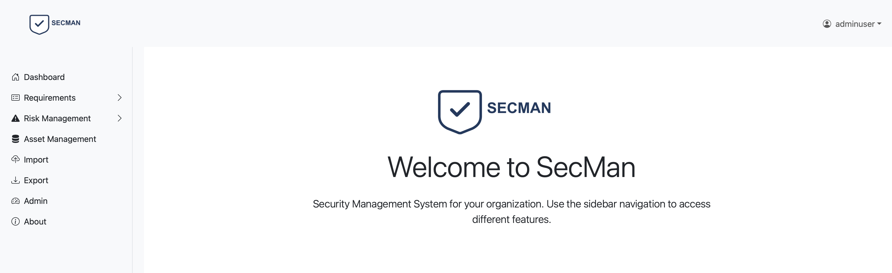

DRAFT DRAFT DRAFT DRAFT

---



**A requirement management, risk assessment management tool**

---


### ALPHA ALPHA ALPHA


## Overview / background

secman was initially started as a security requirement formatter tool. The goal was to generate a beautiful looking MS word document out of a well formatted MS Excel sheet (it was just a helper tool for a repeating task).

Then the idea was born to extend this tooling for some other use cases like risk management or context specific document rendering.

The tool was also started as a test how good / well AI supported coding really works.

---

## Features

- **Requirements Management:** Create, edit, prioritize, and track requirements.
- **Export requirements** in a well formatted word file
- (untested) **Risk Assessment:** Identify, evaluate, and document risks associated with requirements or processes.
- **User Roles:** Assign and manage different user roles (normaluser, adminuser) with appropriate permissions.
- (untested) MCP server
- (untested) E-Mail notification
- (untested) Automatic translation of requirements

## Getting Started

### Prerequisites

- Java (tested with version 21)
- Node.js (tested with version 24)
- MariaDB
- sbt (Scala Build Tool)
- Python (for optional scripts)
- OpenRouter Key (optionally)

### Installation

1. **Clone the repository:**

   ```
   git clone https://github.com/schmalle/secman.git
   cd secman
   ```
2. **Create database**

```cd
cd scripts
./install.sh
```

3. **Build the project (backend):**

```sh
sbt run dev
```

Please note: The play framework ensures that all tables are existing, which are neeeded.

1. **Build the project (frontend):**

   ```sh
   npm run dev
   ```

## Usage

- **Access the UI:** [URL or command to access the user interface]
- **Add requirements:** [Brief instructions]
- **Perform risk assessment:** [Brief instructions]
- **Generate reports:** [Brief instructions]

---

## 

**normaluser:** Basic access for submitting and tracking requirements/risks.

## Roles / Default users (pw password)

- **adminuser:** Full administrative rights, including user management and configuration.
- **normaluser:** Basic access for submitting and tracking requirements/risks.

## Demo

- **Pictures:** Pictures from the live system can be found at pictures folder
- **normaluser:** Run the populate-testdata.sh script from "scripts/tests"

## Contributing

We welcome contributions at a later stage. For the moment any idea / potential topic would be great.

---

## License

A-GPL 3.0 license

---

## Contact

- **Maintainer:** Markus "flake" Schmall
- Mastodon: flakedev@infosec.exchange
- Telegram: flakedev
- **Email:** markus@mschmall.de
