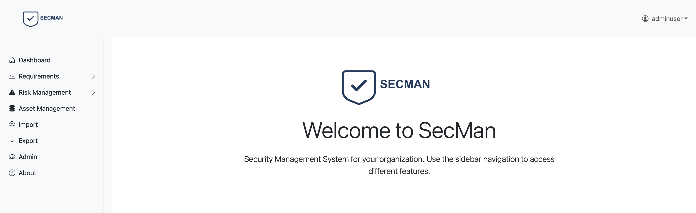

# SecMan

Security requirement, vulnerability and risk-assessment platform.

[](https://www.gnu.org/licenses/agpl-3.0)
[]()



## What it does

- Security requirement lifecycle (versioned releases: PREPARATION → ALIGNMENT → ACTIVE → ARCHIVED), Excel/Word/CSV export, automated translation (OpenRouter, 20+ languages).
- Vulnerability management: CrowdStrike Falcon import, exception-request workflow, statistics, heatmap, materialized view for fast outdated-asset queries (<2s @ 10k assets).
- Asset inventory: Nmap/Masscan import, AD/cloud metadata, criticality, workgroup-scoped access.
- Risk register, demand classification, compliance-framework mapping (SOC2, ISO 27001, NIST).
- AuthN: local (BCrypt) + OAuth2/OIDC + Passkey/WebAuthn + optional MFA.
- AuthZ: 9-role RBAC with row-level filtering on assets (workgroup, ownership, AWS account, AD domain, sharing rules).
- AI integration: 55-tool MCP server (Streamable HTTP) for Claude Desktop/Code and other MCP clients, with mandatory user delegation.
- Email: SMTP/SES with retry + audit, Thymeleaf HTML templates, escalation tiers.

## Stack

Kotlin 2.3.21 / Java 21 · Micronaut 4.10 · Hibernate JPA · Astro 6.3 + React 19 · Bootstrap 5.3 · MariaDB 11.4 · Gradle 9.5.0 (Kotlin DSL) · Picocli 4.7.7 · AWS SDK v2.

## Quick Start (development)

Prereqs: Java 21, Node 20+, MariaDB 11.4+, Git.

```bash
git clone https://github.com/schmalle/secman.git && cd secman
cd scriptpp/install/db && ./installdb.sh && cd -    # creates DB 'secman' / user 'secman'/'CHANGEME'
./scriptpp/startbackenddev.sh                       # canonical dev start (pass-cli wraps gradle)
cd src/frontend && npm install && npm run dev       # http://localhost:4321
```

On first startup the backend auto-creates `admin` with a 20-char random password printed once to stdout (look for `DEFAULT ADMIN USER CREATED`). Copy it immediately. Change it after first login.

> **Production deploys** must replace the default DB password and generate `JWT_SECRET`, `SECMAN_ENCRYPTION_PASSWORD`, `SECMAN_ENCRYPTION_SALT`. See `docs/DEPLOYMENT.md`.

## Layout

```
src/
  backendng/   Kotlin/Micronaut: domain → repository → service → controller, mcp/, dto/, filter/
  frontend/   Astro pages + React islands, services/ (Axios)
  cli/        Picocli commands + service/
docs/         see below
scriptpp/     ALL scripts live here (./scripts is deprecated)
specs/        historical implementation plans (frozen)
```

## Common commands

```bash
# Build & run
./gradlew build                          # full build incl. unit + integration tests
./scriptpp/startbackenddev.sh            # backend dev (port 8080)
cd src/frontend && npm run dev           # frontend dev (port 4321)

# CLI (build once, then use wrapper)
./gradlew :cli:shadowJar
./scriptpp/secman help
./scriptpp/secman query servers --dry-run
./scriptpp/secman send-notifications --dry-run --verbose
./scriptpp/secman manage-user-mappings list --send-email
./scriptpp/secman add-vulnerability --hostname host --cve CVE-2024-1234 --criticality HIGH
./scriptpp/secman export-requirements --format xlsx

# Tests
./gradlew :backendng:test --tests "*ServiceTest*"      # unit
./gradlew :backendng:test --tests "*IntegrationTest*"  # integration (Docker)
./gradlew :cli:test
./tests/e2e/run-e2e.sh                                 # Playwright (pass-cli secrets)
```

## API reference

All endpoints under `/api/*` require `Authorization: Bearer <jwt>` unless noted. SSE endpoints take JWT as `?token=` (EventSource limitation).

| Endpoint | Method | Roles |
|---|---|---|
| `/api/auth/login` | POST | public |
| `/api/requirements`, `.../export/xlsx` | GET | auth |
| `/api/releases`, `.../compare`, `.../{id}` | GET/POST/DELETE | auth (write: ADMIN/REQADMIN; status: ADMIN/RELEASE_MANAGER) |
| `/api/assets`, `.../bulk`, `.../export` | GET/POST/DELETE | auth (bulk: ADMIN) |
| `/api/vulnerabilities/current`, `.../cli-add` | GET/POST | ADMIN, VULN |
| `/api/vulnerability-exception-requests[/pending/count]`, `/api/vulnerability-exceptions` | various | auth |
| `/api/outdated-assets`, `/api/materialized-view-refresh/trigger` | GET/POST | auth (refresh: ADMIN) |
| `/api/notification-preferences`, `/api/notification-logs` | GET/PUT | auth (logs: ADMIN) |
| `/api/account-vulns`, `/api/wg-vulns`, `/api/domain-vulns` | GET | auth |
| `/api/workgroups[/{id}/{users,assets,aws-accounts}]` | GET/POST/DELETE | ADMIN |
| `/api/aws-account-sharing[/{id}]` | GET/POST/DELETE | ADMIN |
| `/api/vulnerability-heatmap[/refresh]`, `/api/external/vulnerability-heatmap` | GET/POST | auth/API key |
| `/api/import/upload-{xlsx,nmap-xml,vulnerability-xlsx,user-mappings[-csv],assets-xlsx}` | POST | ADMIN |
| `/api/user-mappings[/...]` | GET/POST/PUT/DELETE | ADMIN |
| `/api/identity-providers[/{id}[/test]]` | GET/POST/PUT/DELETE | ADMIN |
| `/api/maintenance-banners[/active|/{id}]` | GET/POST/PUT/DELETE | ADMIN (active: public) |
| `/api/users/profile[/change-password,mfa-{status,toggle}]` | GET/PUT | auth |
| `/oauth/{authorize,callback}` | GET | public |
| `/mcp` | POST | MCP API key + delegation |
| `/health`, `/memory` | GET | public |

Full reference: `CLAUDE.md`.

## MCP integration (AI assistants)

Claude Code:
```bash
claude mcp add --transport http secman http://localhost:8080/mcp \
  --header "X-MCP-API-Key: sk-..." \
  --header "X-MCP-User-Email: you@company.com"
```

Claude Desktop (`claude_desktop_config.json`):
```json
{ "mcpServers": { "secman": {
    "url": "http://localhost:8080/mcp",
    "headers": { "X-MCP-API-Key": "sk-...", "X-MCP-User-Email": "you@company.com" }
} } }
```

`X-MCP-User-Email` is **required** for all `tools/list` and `tools/call`. Effective permissions = intersection of API-key permissions ∩ delegated user's role-implied permissions. See `docs/MCP.md`.

## Configuration

Backend reads `src/backendng/src/main/resources/application.yml` and env vars. Minimum required for production:

```bash
DB_CONNECT=jdbc:mariadb://localhost:3306/secman
DB_PASSWORD=...
JWT_SECRET=$(openssl rand -base64 32)
SECMAN_ENCRYPTION_PASSWORD=$(openssl rand -hex 32)
SECMAN_ENCRYPTION_SALT=$(openssl rand -hex 8)
SECMAN_BACKEND_URL=https://api.example.com
FRONTEND_URL=https://secman.example.com
```

Full reference (SMTP, OAuth retry, memory tuning, debug logging, vuln settings): `docs/ENVIRONMENT.md`.

## Documentation

| Document | What's in it |
|---|---|
| [docs/ARCHITECTURE.md](docs/ARCHITECTURE.md) | Layered architecture, data model, design patterns |
| [docs/DEPLOYMENT.md](docs/DEPLOYMENT.md) | Linux production: nginx, systemd, SSL, hardening |
| [docs/ENVIRONMENT.md](docs/ENVIRONMENT.md) | All env vars (backend, frontend, CLI) |
| [docs/CLI.md](docs/CLI.md) | CLI commands, cron, S3 ops |
| [docs/MCP.md](docs/MCP.md) | MCP tools, API keys, delegation, troubleshooting |
| [docs/CROWDSTRIKE_IMPORT.md](docs/CROWDSTRIKE_IMPORT.md) | Transactional-replace pattern, JPA cascade trap |
| [docs/TESTING.md](docs/TESTING.md) | JUnit/Mockk/Testcontainers stack and patterns |
| [docs/TROUBLESHOOTING.md](docs/TROUBLESHOOTING.md) | Symptom → diagnosis → fix |
| [docs/S3_USER_MAPPING_IMPORT.md](docs/S3_USER_MAPPING_IMPORT.md) | `import-s3` / `download-s3` / `print-s3` / `list-bucket` |
| [docs/E2E_EXCEPTION_WORKFLOW_TEST.md](docs/E2E_EXCEPTION_WORKFLOW_TEST.md) | Vuln-exception MCP E2E |
| [docs/SKILLS_AND_AGENTS.md](docs/SKILLS_AND_AGENTS.md) | Claude Code skills + sub-agents wired to this repo |
| [docs/PASS_CLI.md](docs/PASS_CLI.md) | `pass-cli` (Proton Pass) secret resolution |
| [docker/README.md](docker/README.md) | Docker container deployment |
| [INSTALL.md](INSTALL.md) | Step-by-step install |

## Workflow

Branches: `###-feature-name`. Commits: `type(scope): description` (Conventional Commits). PRs need security review for AuthN/AuthZ/crypto/storage changes.

## Roadmap (open)

Vulnerability correlation/trending · automated remediation workflows · Tenable/Qualys integrations · advanced reporting dashboards · SAML/LDAP · ML risk scoring.

## License & contact

[AGPL-3.0](https://www.gnu.org/licenses/agpl-3.0). Maintainer: Markus "flake" Schmall — markus@schmall.io · [@flakedev@infosec.exchange](https://infosec.exchange/@flakedev). Built with assistance from Anthropic Claude.

> **Alpha software.** Test before production use.
